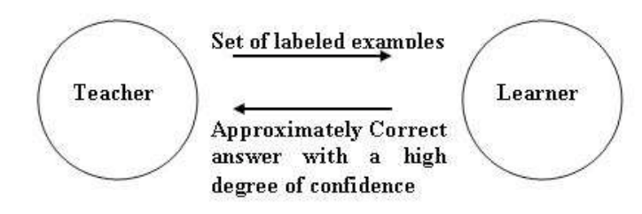
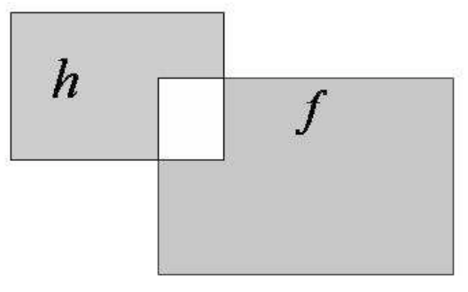

# Introduction to PAC Learning Theory

## Introduction 

So far, we've learned a bit about the models that are used for machine learning tasks, such as regression and classification. Before we dig further into machine learning and modeling, it's helpful to understand a bit more about the underlying principle behind supervised learning as a whole--**_Probably Approximately Correct (PAC) Learning Theory_**!

## Objectives
You will be able to:
- Understand and describe the PAC learning theory 
- State how PAC theory relates to computational (machine) learning practices
- Identify the major factors of PAC theory and describe how the error and confidence measures are used to approximate a desired function

## Intuition behind PAC

 
Although PAC Learning Theory has a name that is a bit confusing and more than a little funny, the intuition behind it makes pretty good sense, and gives us a better intuitive grasp of exactly what we're going when we fit a machine learning model to a bunch of data in order to make predictions. Think about everything you've learned about regression so far--we take a bunch of data, and use that data to create the best possible equation that describes a line that we can use to make predictions. Although regression models can differ wildly because of things like number of predictors, variance in the data, and the actual type of regression model used, there are some things that we can always count as a fact. The first is that we the function we are learning by building a regression based on our data may get close to the underlying **_Ground Truth_**, but it will never be perfect. Instead, our model is an **_approximation_** of the actual function that created the data we trained our model on, not the real thing.  A lack of perfection doesn't mean our model is useless, however. For instance, if you built a model that was able to predict changes in the stock market with 70% accuracy, you're probably going to make a lot of money. In machine learning, our models are _Approximately Correct_, and we're okay with that. 

> **"All Models are wrong. Some are useful." - George Box**

The second main point here is that we learn our model approximations from data gathered from the wild. Things from the wild are naturally subject to noise and randomness. This means that our models won't always be as trustworthy as we think they are, due to random chance affecting our data. This makes more sense when we think about the amount of data used to train a model. We can train regression model with only 10 rows of data. We can also train a model with 10 million rows of data. Which one would you have more faith in? 

Obviously, the more data we have to train our model, the more **_confidence_** we can have in the correctness of that model. In the example above, we intuitively understand that a model trained on a very small dataset may not generalize well to the real world, because it's hard to know if those 10 data points are representative of real data, or if randomness may have tricked us by giving us a sample of 10 data points that is not like the real world. Our model is only as good as our data, and with only 10 data points, we can't be very confident in that our data is representative of the overall population. However, when we use 10 million data points to train a regression model, things change. Randomness may trick us with only 10 data points, but with 10 million, the odds are much lower. We learned about this concept when we studied **_Confidence Intervals_**--the size of our confidence interval is dependent upon the size of our dataset, and the variance found within it. The important takeaway here is that we can quantify our confidence our model, but we can never know with 100% certainty that the function approximation our model discovered actually approximates the ground truth function that describes the data in the real world--there's always a nonzero chance, however small it may be, that our model might have learned an approximation that doesn't actually describes our (weird) sample and not the overall population. Viewed in this light, the strange name of PAC learning makes more sense--just picture a conversation where you explain what your model can and can't do to someone that doesn't understand modeling. 

"Did the model discover the underlying function for {some thing we want to measure}?"

"No, but it approximates it well enough that it is useful to us". 

"Are we sure that this approximation is actually correct?"

"Probably. Our confidence interval is {x}."

Hence the name, **_Probably Approximately Correct Learning Theory_**!

## Function Approximation

Let's put this in more mathematical terms to better understand exactly how PAC Learning Theory works. 

In PAC, we do not expect the learner to learn the __exact__ function most of the time, due to limits on available examples and noise in the data etc. We expect the learner to find a function $h$ which is very close to the desired function $f$. So we say that __$h$ approximates $f$__ , and that is function we are interested in learning. 

Let's examine some more formalized definitions of the operative words in PAC:

**"Probably: "** If learner outputs the data with desired probability and confidence, the results are probably correct

**"Approximately: ."** A hypothesis is approximately correct if its error over the distribution of inputs is bounded by some predefined interval. 

The results of PAC learning are therefore called "**Probably Approximately Correct**"!

## Error Calculation

Based on these, PAC gives:
- an upper bound on the error in accuracy with which h approximates f and 
- the probability of failure in achieving this accuracy. 

With these quantities, we an express the definition of a PAC Algorithm with more mathematical clarity. 

> __For PAC Learnability, the learner must find a concept $h$ such that the error between $h$ and $f$ with acceptable range with a predefined level of confidence.__ 

We can further clarify our definition of _approximation_ by thinking of this in terms of probability distributions. The notion of approximation is described as:

__There is some probability distribution $D$, defined in the sample sample $[0,1]|^n$ giving probability of each example.__ So we are picking examples from this distribution, at random. Also, its imperative to mention that the all the examples that learner is provided with are __iid__ ,independent and identical . Considering the total probability of seeing a sequence of examples over $D$ , we will use the product rule.

The distribution $D$, conveniently and mathematically quantifies the error with which $h$ approximates $f$ as shown below:

$$err(h, f) ≡ P_{x∈D}(h(x) \neq f(x))$$

If we wanted to read this equation out loud, we would say:

"The error rate of our approximated function $h$ in relation to our ground-truth function $f$ is equal to the probability $P$ that our samples $x$ come from the probability distribution $D$ where $h(x)$ does not equal $f(x)$."

$P_{x∈D}$ reflects the probabilities are taken with respect to random draws over $D$ __only__. Luckily, this is much easier to understand when we visualize it. In terms of set theory, our error is the __symmetric difference__ between the sets corresponding to $h$ and $f$ over $X$, shown in the shaded areas below, highlighting probabilistic region of disagreement between $h$ and $f$, which gives us the probability of error:

## PAC Examples

PAC Learning theory has its roots in mathematics, and this is a topic where we can go pretty deep down the rabbit hole. Although having a deep understanding of PAC Learning Theory isn't a requirement for being a good data scientist or building awesome models, it never hurts to know a bit more about the subject. If you're the type of person that likes reading mathematical proofs and definitions, check out [this link](https://www.cs.princeton.edu/courses/archive/spring14/cos511/scribe_notes/0211.pdf)! The document details following problems that are PAC learnable. 
- Learning positive half-lines
- Learning intervals
- Learning axis-aligned rectangles

## How PAC relates to Machine Learning 

PAC uses the term 'hypothesis',whereas ML literature normally uses the term 'model'. So we have seen that Machine learning starts with some data, $(x_i,y_i)$ and we want to find a hypothesis (or model) that will, given the inputs $x_i$ return $y_i$ or something very close. More importantly given new data x̃  the model will  predict the corresponding ỹ.

A model that was created using some (out of many examples) of data do not accurately reflect that data set, but can be accurate on any future data sets. The two important points are that we cannot predict new data with 100% accuracy. There is also the possibility that the one or more examples are poor and do not explain much. 

We present our data to the learner and let it make an attempt to learn the hypothesis function. At discrete stages ,we  then look at the error as the difference between real and hypothesis function outputs. A problem is called learnable if we can reduce this error within acceptable bounds. 

---
So that is PAC. It is essentially provides theoretical and mathematical underpinning to different stages of machine learning that we have been looking at in our course. This theory justifies the need for splitting data into test and training sets. It gives a reason to tune hyperparameters as the learner is independent of the data distribution. This theory also provides grounds for the evaluation methods we have seen including RMSE, ROC, AUC etc. to ensure that our model is learning and approximating a desired function. 

## Additional Resources

A deeper understanding of PAC requires looking at some examples with proofs of how we identify PAC learnability. You are encouraged to visit following resources which will elaborate the points highlighted in this lesson.   

- [PAC: A Formal theory of learning](https://jeremykun.com/2014/01/02/probably-approximately-correct-a-formal-theory-of-learning/)
- [Theoratical Machine Learning](https://www.cs.princeton.edu/courses/archive/spring14/cos511/scribe_notes/0211.pdf)
    

## Summary 

In this lesson, we looked at how PAC learning allows us to develop models , train and evaluate them in a computational learning domain. We looked at developing a basic intuition behind this theory and how it relates to different stages of model development that we have been looking at. You are encouraged to read into this theory and try to relate all the upcoming architectures to this theory to help you develop a sound and scalable understanding of ML from theory to practice. 
