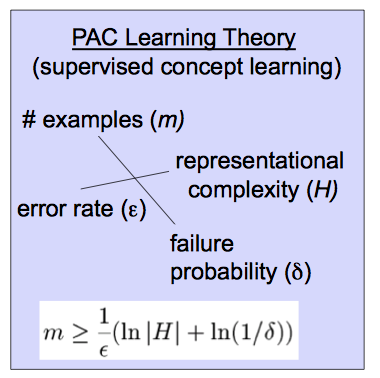

# Introduction to PAC Learning Theory

## Introduction 

**Probably Approximately Correct (PAC)** computational learning theory provides a mathematically rigorous definition of statistical machine learning in a computational environment. This forms the basis of what we call "Machine Learning" (ML).

So far, we have looked at the steps required to run simple machine learning algorithms including data representations, feature selection and engineering, training, prediction and loss calculation. In this lesson, we shall provide a brief overview of a __Probably Approximately Correct__ or __PAC__ learning theory that provides a theoretical foundation for experimental settings that we have seen in previous sections. **In essence , PAC deals with the computational aspect of machine learning**. The theory helps us anticipate the required levels of sample complexity and associated computational complexity in order to answer an analytical question. 

## Objectives
You will be able to:
- Understand and describe the PAC learning theory and associated computational framework
- State how PAC theory relates to computational (machine) learning practices
- Identify the major factors of PAC theory and describe how the error and confidence measures are used to approximate a desired function

## Intuition behind PAC

> The PAC is a learning models which is characterized by __learning from examples__. 

Let's see how we can formulate a basic learning framework from given examples.

In its simplest form, consider $f$ as the target function to be __learnt__, the __learner__ (the computational model) is provided with some random examples in the form :

$$(X,f(X))$$.

Here, $X$ is a binary input instance of length $n$, and $f(X)$ is the value (boolean TRUE or FALSE) of the target function at that instance. So in essence, we are being provided with a number of input examples and a target output specifying weather the input is a positive or negative. Any binary classification problem can fit this scenario ranging from disease identification, customer retention to results of a game of sports (win/lose). 

Based on these examples, the __learner must succeed__ in calculating the target function $f$ which is expressed  as:

$$f : [0, 1]^n → {0, 1}$$. 

So what do we actually mean by __success__ here?  It should actually be any measure or a series of evaluation steps that help us find that the __algorithm meets the experimental criteria__. Hence this approach can be shown using the model below:

For computational learning, we need a theory to relate following components together:

- Probability of successful learning 
- Number of available training examples
- Complexity of hypothesis space
- Required level of accuracy
- Manner in which training examples are presented

Probably approximately correct (PAC) learning theory helps analyze whether and under what conditions a learner $L$ will **probably** output an **approximately correct** classifier. 

First, let's define the "approximate" aspect of this theory.  

> A hypothesis $h∈H$ is **approximately correct** if its error over the distribution over inputs $D$ is bounded by some error $\epsilon$ , such that  $0 \le \epsilon \le \frac{1}{2}.$ 

Next, "probably." 

> If $L$ (the learner) outputs such a classifier with probability $1−δ$, with $0 \le \delta \le \frac{1}{2}$, we call that classifier **probably approximately correct**.

Knowing that a target concept is **PAC-learnable** allows us to bound the sample size necessary to probably learn an approximately correct classifier. This is shown in the figure below:

In the equation shown above i.e. $m \ge\frac{1}{\epsilon}(ln|H| + ln\frac{1}{\delta})$, note the effects on $m$ when we alter variables in the right-hand side. 

As allowable error $\epsilon$ decreases, the necessary sample size $m$ grows. i.e. a higher number of samples will be required to conclude an experiment with a low margin of error. sample size grows with the probability of an approximately correct learner, and with the size of the hypothesis space $H$. 
> __A hypothesis space is the set of all classifiers (models) that our algorithm considers before selecting the best one.__

More plainly, as you consider more possible classifiers, or desire a lower error or higher probability of correctness, you need more data to distinguish between them.

Let's see these concepts in a bit more detail below:

## Failure Probability 

> __PAC learning approach places an upper bound on the probability of error by placing a lower bound on the number
of examples required to learn the target function.__

Let's see what this means. According to PAC, there is always a small probability that the learning algorithm will fail and the results produced will not be accurate. One obvious reason could be that learning examples do not fully reflect the probability distribution that the examples belong to. This hinders learning process seriously and target function $f$ can not be successfully achieved. insufficient examples is something that we come across very often in machine learning discipline.  PAC Learning attempts to reduce the probability of getting poor examples by __considering a sufficient number of examples__ for learning the required function. 

## Function Approximation

In PAC, we do not expect the learner to learn the __exact__ function most of the time, due to limits on available examples and noise in the data etc. If the learner attempts to learn the exact function from given data, we often stop the learning process to avoid an over-fitting and promote generalizability.  So we expect the learner to find a function $h$ which is very close to the desired function $f$. So we say that __$h$ approximates $f$__ , and that is the function we are interested in learning. 

## Error Calculation

Error calculation with PAC learning is the probability of failure in achieving the required level of accuracy. 

With these quantities, we an express the definition of a PAC Algorithm with more mathematical clarity. 

> __For PAC Learnability, the learner must find a concept $h$ such that the error between $h$ and $f$ with acceptable range with a predefined level of confidence.__ 

As we saw above, **approximation** is based on some probability distribution $D$, defined in the sample sample $[0,1]|^n$ giving probability of each example. 

We are taking examples from this distribution at random and all the examples that learner is provided with are __iid__ ,independent and identical. Considering the total probability of seeing a sequence of examples over $D$ , we will use the product rule.

The distribution $D$, conveniently and mathematically quantifies the error with which $h$ approximates $f$ as shown below:

$$err(h, f) ≡ P_{x∈D}(h(x) \neq f(x))$$

$P_{x∈D}$ reflects the probabilities are taken with respect to random draws over $D$ __only__. In terms of set theory, our error is the __symmetric difference__ between the sets corresponding to $h$ and $f$ over $X$, shown in the shaded areas below, highlighting probabilistic region of disagreement between $h$ and $f$ and hence gives
the probability of error:

A PAC Learning Algorithm would always be independent of underlying distribution i.e. $D$. The only restriction on the setting is that we must calculate the probability of error over the same distribution from which we draw our iid examples. The learner sees  examples so that the probability of a poor example i.e. an error over the same distribution reduces to some specified bounds. 
It is therefore natural to calculate the error probability over the same distribution that was used during the learning phase. And as you can see, we have taken care of this fact in equation above which calculates the probability over D only.

## PAC Examples

[Visit this link](https://www.cs.princeton.edu/courses/archive/spring14/cos511/scribe_notes/0211.pdf) for detailed problem definitions with mathematical proofs and intuitions behind some PAC theorems. The document entails following problems that a PAC learnable. 
- Learning positive half-lines
- Learning intervals
- Learning axis-aligned rectangles

## How PAC relates to Machine Learning 

> PAC uses the term '__hypothesis__', whereas ML literature normally uses the term '__model__'. We have seen that machine learning experiments start with some data, $(x_i,y_i)$ and we want to find a hypothesis (or a model) that will, given the inputs $x_i$ return $y_i$ or something very close. More importantly given new data $x̃$  the model will  predict the corresponding $ỹ$.

A model that was created using some (out of many examples) of data do not accurately reflect that data set, but can be accurate on any future data sets. The two important points are: 

- We cannot predict new data with 100% accuracy.
- There is always a possibility that the one or more examples are poor and do not explain much. 

We present our data to the learner and let it make an attempt to learn the hypothesis function. At discrete stages, we look at the error as the difference between real and hypothesis function outputs. 

>A problem is called learnable if we can reduce this error within acceptable bounds. 

---
So that is PAC. It is essentially provides theoretical and mathematical underpinning to different stages of machine learning that we have been looking at in our course. This theory justifies the need for splitting data into test and training sets. It gives a reason to tune hyper parameters as the learner is independent of the data distribution. This theory also provides grounds for the evaluation methods we have seen including RMSE, ROC, AUC etc. to ensure that our model is learning and approximating a desired function. 

## Additional Resources

A deeper understanding of PAC requires looking at some examples with proofs of how we identify PAC learnability. You are encouraged to visit following resources which will elaborate the points highlighted in this lesson.   

- [PAC: A Formal theory of learning](https://jeremykun.com/2014/01/02/probably-approximately-correct-a-formal-theory-of-learning/)
- [Theoretical Machine Learning](https://www.cs.princeton.edu/courses/archive/spring14/cos511/scribe_notes/0211.pdf)
    

## Summary 

In this lesson, we looked at how PAC learning allows us to develop models , train and evaluate them in a computational learning domain. We looked at developing a basic intuition behind this theory and how it relates to different stages of model development that we have been looking at. You are encouraged to read into this theory and try to relate all the upcoming architectures to this theory to help you develop a sound and scalable understanding of ML from theory to practice. 
